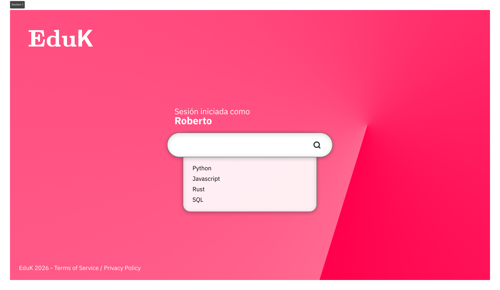

# Reto-ODS4-Nombre

### 1. El Diagnóstico (El Bug):
Actualmente recibimos una educación de calidad pero hemos detectado un **bug crítico** en nuestro entorno educativo que necesita ser corregido.
1. Disponemos de plataformas lentas y herramientas poco intuitivas que frenan el ritmo de aprendizaje.
2. Hay un evidente exceso de teoría por tema y muy poquita práctica real enfocada a un entorno de la vida real.
3. Los recursos de los que disponemos están poco organizados, se encuentran en múltiples plataformas sin un orden claro.
4. El ritmo que se sigue es el mismo para todos perjudicando a los alumnos que no logran igualar dicho ritmo individualmente.

Diagnóstico: La educación es buena, pero no está totalmente adaptada al entorno digital actual ni al ritmo del sector
tecnológico.    

### 2. La Solución (La App):

#### EduK
Una plataforma pública para que los profesores organicen mejor el material y publiquen el progreso de cada alumno. Además, para motivarlos se harían retos semanales de cada módulo o asignatura y un analisis realizado con IA sobre el rendimiento en cada mes. También adaptaríamos la app a que sea visible tanto en PC como en Móvil y la interfaz sería visualmente atractiva y moderna.
Una funcionalidad extra que tendría la app sería la posibilidad de realizar trabajos en grupo con otros alumnos mediante chat grupales y meetings estilo Google Meet.
Los problemas que se resuelven:
1. Desorganización de materiales.
2. Falta de seguimiento individual.
3. Poca práctica guiada con feedback real.

### 3. El Prototipo:

